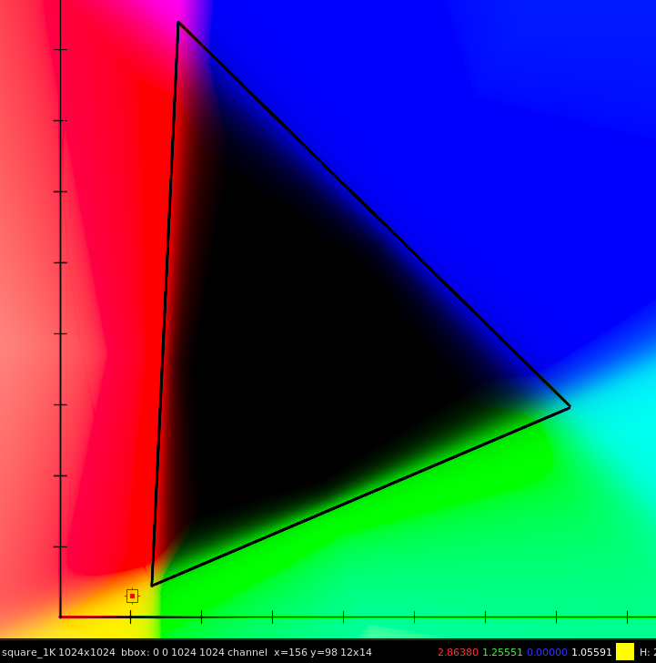

# GamutCompress
is a tool to compress out of gamut rgb color values back into gamut.

### Context
Out of gamut colors can ocurr with modern digital cinema cameras. If using the camera manufacturer's color pipeline there would be no issue. However with color management pipelines like the [Academy Color Encoding System](https://www.oscars.org/science-technology/sci-tech-projects/aces), there is a working colorspace into which all source imagery is transformed using an IDT or Input Device Transform. 

In the case of ACES this working colorspace is ACEScg. The ACEScg gamut is smaller than most digital cinema camera gamuts. Because of this, when the IDT is applied, highly saturated colors can go out of gamut. Usually when this happens, one of the RGB components is a high value, and one or more of the other components are negative values.

If cameras were colorimetric devices that satisfied the [Luther condition](https://en.wikipedia.org/wiki/Tristimulus_colorimeter), there would be no problem. But, because this is not the case, most cameras will hapilly generate RGB tristimulus values that lie outside of the spectral locus. This is possible because the spectral locus represents the bounds of color perceivable by the spectral response curves of the human eye. A digital cinema camera's sensor has spectral response curves that are not the same!

These out of gamut colors most often ocurr with highly saturated light sources like police lights, neon lights, or lasers.

Above is a contactsheet of [sample images](https://www.dropbox.com/sh/u6z2a0jboo4vno8/AAB-10qcflhpr0C5LWhs7Kq4a?dl=0) from the [Gamut Mapping ACES Virtual Working Group](https://community.acescentral.com/c/aces-development-acesnext/vwg-aces-gamut-mapping-working-group/80) with the ACES Rec709 RRT display rendering transform applied. (For more info on the working group check out the [working group proposal](https://www.dropbox.com/s/5hz8e07ydx0d2bm/ACES_Gamut_Mapping_Working_Group_Proposal_Approved.pdf).

If the display rendering transform does not elegantly handle out of gamut colors, artifacts such as those seen above can occur. The negative values of the out of gamut colors can pose issues for image processing.

Re-mapping these colors back into gamut is useful for pleasing color reproduction, and for enabling easy image manipuluation in visual effects.

### How it Works

To help visualize this description we will use this image: a colorwheel plotted in CIE 1931 2 degree standard observer xy chromaticity diagram.

The gamut compression algorithm is actually very simple. Because it works in a scene-referred linear domain, perceptual attributes like luminance, hue, and saturation don't have a meaning. Therefore it works in a very simple way purely with the RGB color components. 

The algorithm is built to run per-pixel given a basic set of user-defined parameters. It constructs two representations of the image:
- Achromatic: Similar to luminance, this represents the achromatic axis in the color cube. Achromatic is constructed by taking the maximum of the R, G, and B color components. `achromatic = max(r,g,b)`
- Distance: Similar in concept to saturation, distance represents the distance of an RGB triplet from the achromatic axis. `distance = (achromatic - rgb) / achromatic`. 

Here is what the above colorwheel image looks like transformed into the distance representation.

Dividing by achromatic makes it so that the gamut boundary is a value of 1.0, and anything beyond it is above 1.0.

This allows us to compress the distance using a tonemapping compression function, and then transform achromatic and distance back into an RGB image.
- `rgb = achromatic - distance * achromatic` 

### Usage

Threshold is the percentage of the outer gamut to affect. A value of 0.2 will compress out of gamut values into the outer 20% of the gamut.

Max Distance is the distance past the gamut boundary to map to the gamut boundary. For example, a value of 0.2 will compress distance values of 1.2 to a value of 1.0. Individual controls are given for each color component (`cyan, magenta, and yellow`). These controls can be used to tune the look of the compression creatively, or to optimize for different source gamuts. Alexa Wide Gamut and RedWideGamutRGB have very different maximum possible distances for each of the color components, because their primaries are very different.

Method specifies the type of compression curve to use. Currently the master branch only has a simple Reinhard compression curve enabled, but if you check out the dev branch there are a few different experimental options. 

Inverting the gamut compression exactly is also possible. This workflow might be necessary in visual effects pipelines where the source plates need to be delivered back to the client exactly as they came in. There should be an excess of caution used with this workflow however. If highly saturated colors in the outer 20% of the color gamut are uncompressed, the results might be very extreme and unpredictable. Efforts should be undertaken to watch this eventuality very closely if this workflow is used.

A DCTL for Blackmagic Resolve is also provided. This is based on the [initial version written by Nick Shaw](https://github.com/nick-shaw/gamut_mapping). Huge thanks to him for putting that together! He also has a Matchbox shader in his repo which might be of use in Baselight or Flame.

### About
Written by Jed Smith with [tons of help](https://community.acescentral.com/t/rgb-saturation-gamut-mapping-approach-and-a-comp-vfx-perspective) from the [ACES Gamut Mapping Virtual Working Group](https://community.acescentral.com/c/aces-development-acesnext/vwg-aces-gamut-mapping-working-group). 
